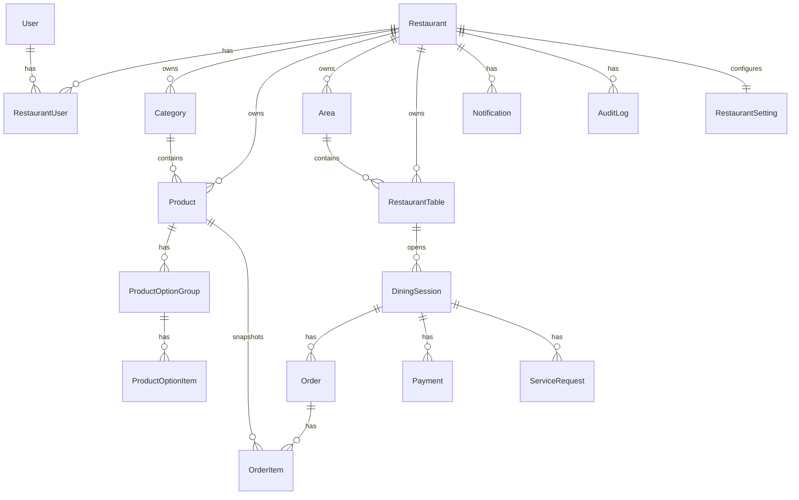

# Database ERD

```mermaid
erDiagram
  User ||--o{ RestaurantUser : has
  Restaurant ||--o{ RestaurantUser : has
  Restaurant ||--o{ Category : owns
  Restaurant ||--o{ Product : owns
  Restaurant ||--o{ Area : owns
  Restaurant ||--o{ RestaurantTable : owns
  Area ||--o{ RestaurantTable : contains
  Category ||--o{ Product : contains
  Product ||--o{ ProductOptionGroup : has
  ProductOptionGroup ||--o{ ProductOptionItem : has
  RestaurantTable ||--o{ DiningSession : opens
  DiningSession ||--o{ Order : has
  Order ||--o{ OrderItem : has
  Product ||--o{ OrderItem : snapshots
  DiningSession ||--o{ Payment : has
  DiningSession ||--o{ ServiceRequest : has
  Restaurant ||--o{ Notification : has
  Restaurant ||--o{ AuditLog : has
  Restaurant ||--|| RestaurantSetting : configures
```
